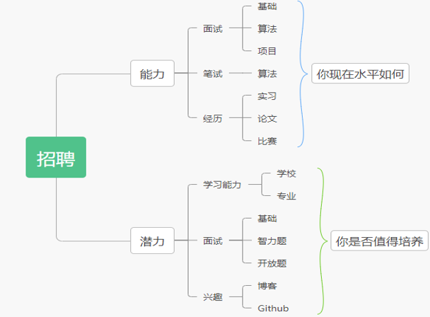
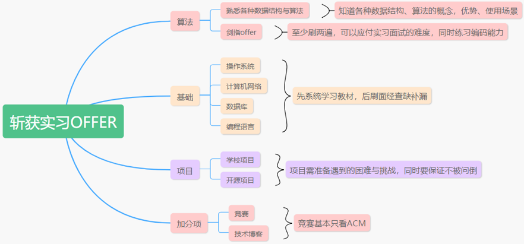

本篇文章是关于如何拿大厂offer的信息汇总

<!--truncate-->

# 一、前言

## 1.1本科找工作一般流程

- 大三上寒假：刷题+项目+八股文
- 大三下一月到四月：投递**暑期实习**
- 大三下三月到六月：笔试面试
- 大三下暑假：实习+提前批
- 大四上九月：答辩转正
- 大四上九月到十月：秋招投递
- 大四下十月到十二月：笔试面试

## 1.2简历怎么写

- 要素：基本信息、项⽬经历、实习/⼯作经历、技术⽔平等
- 排版：**模版**即可无需太多时间，github 搜索 “resume”/“简
历”（⽐如：[https://github.com/billryan/resume](https://github.com/billryan/resume)）
- 样例：分享个普通的[简历](https://github.com/FlareNKU/GloryPath/tree/main/blog/files/template.pdf)，该同学拿到了30W年薪

## 1.3内推怎么找

- 学长学姐
- 内推群
- github/⽜客⽹

# 二、如何斩获大厂offer

## 2.1大厂看中什么

- 你现在会干什么
  - 把你招进来，你能不能干活，能干多少活，能不能把活干好
- 你将来能干什么
  - 经过几个月的培养以后，你能达到什么样的高度

## 2.2招聘考量

## 2.3实习的重要性

大厂以字节为例，50%拿到offer的同学有字节的实习经历

## 2.4如何斩实习招offer

## 2.5如何斩获校招offer

- 一份大厂实习或ACM金牌
- 优秀的算法能力
  - Leetcode 300题
  - 两遍剑指offer
- 扎实的计算机基础
- 有亮点的项目经历
  - 用到了哪些数据结构、框架、设计模式
  - 遇到了哪些困难以及如何解决他们的

# 三、学习素材推荐

## 3.1基础知识

- 程序员网站：**牛客网**、Github、Stackoverflow
- 操作系统：**CSAPP**、鸟哥的Linux私房菜
- 计算机网络：谢希仁版计网
- 数据库：高性能MySQL
- C++：C++ Primer、Effective C++、STL源码剖析
- 数据结构与算法：Leetcode、**剑指OFFER**
- 中间件（Redis、Kafka、ElasticSearch等）：各博客

## 3.2重点排序

对于大多数开发岗：**计算机网络**>=**操作系统**>软件工程/系统设计>数据库>工具(git)>编译原理

## 3.3加分技能

底层构造与数学原理、应用框架的系统设计、数据分析和机器学习、工作流程工具等

## 3.4一些速成博客

[https://programmercarl.com/](https://programmercarl.com/)

[http://www.cyc2018.xyz/](http://www.cyc2018.xyz/)

[https://xiaolincoding.com/](https://xiaolincoding.com/)

# 四、offer对比

- 薪资
  - 22年秋招行情，北上广一线城市白菜价月薪2W，总包30W，银行8折，招商(北京)去年开24W
  - 天津6~7折大概18~21W上下，**天津企业压价多**，要积极和HR谈，给少了尽量别来
- 城市
  - 一线或新一线或老家，二线需考虑，三四五线慎重
- 福利
  - 通常讲大公司福利多于小公司，国企和外企多于私企
- 发展前景
  - 大公司升职难，小公司可能一夜暴富也可能倒闭
  - 小公司干杂货的可能性更大

**注**：在薪资差距不是很大的情况下，第一份工作建议选择**大平台**，就像高考去985还是211学校一样，大平台给你未来的职业发展更多可能性。互联网红利期差不多结束了，现阶段通过打工基本无法实现财富自由，那么如何实现？创业。朋友们当你有了一定的工作经验和资本积累之后想一想**创业**这条路。

# 五、强心剂

尽管互联网上各种舆论说互联网找工作天昏地暗、灰飞烟灭等等。但是对你们并不适用，985学校的同学找工作没有任何问题。可以这么说，就算是大学打了三年游戏的同学，大三暑假刷刷题，背背八股文好好准备三四个月秋招的时候也能拿到年薪30W的offer（不夸张），所以说没有任何必要焦虑，即使没有实习没有项目，暑假才开始准备也是来得及的，认真准备就行了。23届能力一般的同学投简历后拿到面试的概率超过**1/8**，面试后拿到offer的概率超过**1/10**，所以大概准备300份简历使劲投就完了。
