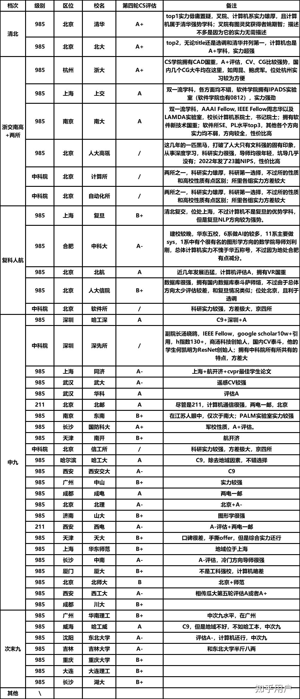

## 背景

本科：南开大学计算机学院

专业：计算机科学与技术

排名：37/126

推免去向：电子科技大学信息与软件工程学院

## 前言

本人成绩平平，本科前三年纯躺平，一直得过且过，无科研经历，无竞赛，六级没过。能获得推免资格是因为前面放弃资格的大佬较多（在此感谢前面的大佬）。一般来说保研本校是最好的选择，只需要提前联系心仪的导师，面试也是轻松愉悦的聊天。然鹅我六级没过导致无法保研本校（NKU计院接受推免生有六级要求），这也导致拿到推免资格后经历了半个月艰辛的预推免，由于确认推免资格时已经较晚，之前也没想到能保研，没有做任何准备，很多学校都已经关闭了预推免报名通道。并且我家在成都，以后也想在这边发展，最终选择了成电信软。在此分享我认为保研外校时需要知道的一些知识和一些建议，具体的某所学校的经验大家可以自己去搜索，知乎等平台上有很多经验贴。保研打的就是信息战，获取越多的信息和经验，有助于你们做出更好的选择。

## 术语解释

保外的同学在了解信息时经常接触到一些术语，可能不是很明白什么意思，所以在此进行解释。以下术语解释参考[知乎链接](https://zhuanlan.zhihu.com/p/502719456)

- bar：学校的门槛

- rk： rank，指排名

- oq（over qualified）：学校认为你的实力比较强，发你 offer 你也大概率不来，所以不选择你，把名额留给更可能来的同学（是否正确判断 oq 一般取决于行政老师的表筛水平）

- wl（waiting list）：候补名单，前面的人可能会鸽（一般在 wl 中的前几甚至前几十都有很大机会能上岸该校，例如南大计算机、中山计算机、浙软等）

- offer： 表示复试通过，一般认为是“录取承诺” —— 即 9.28 推免系统正式开放后按时在系统内填报该院校并完成接受复试和接受拟录取即获得该学校的录取资格（注：部分学校存在超发等现象，offer 仅作为“优先录取承诺”；有的院校摆明了超发，让学生在 9.28 拼手速）

- 强 com：学院的权力比较大，更多的是学院统一审核简历决定是否给offer（大多数学校都是强 com，例如南大计算机、中山计算机等）

- 弱 com：导师的权力比较大，更多的是由你联系的导师来决定谁是否给offer（例如计算所存在霸面的情况）

- 套磁：指向导师发邮件自荐，推销自己

- title：学校的牌子/档次/知名度

  这里给出绿群内部的学校排名（仅供参考）：

  

## tips

流程：如果预计自己能够拿到推免资格，可报名

1、 无论保研本校或者保研外校，首先都需要获取推免资格。推免资格根据综测排名认定，其中最主要便是专业成绩，因此想要获取推免资格卷专业成绩非常重要。当然有些竞赛奖项或者发表论文也可以加分，有的话更好，因为大家学分绩都差不太多，一点加分可以让排名提高很多。

2、保外校的学弟学妹建议加入计算机保研交流群（简称绿群，因为群头像是绿色的），QQ群号 605176069（一群）、943826679（二群），[github组织](https://github.com/CS-BAOYAN)，从中可以获取很多重要信息，

3、参加夏令营，暑假之前去你心仪的学校官网查看夏令营的通知，如果能够拿到优秀营员，恭喜你预推免的时候就可以躺平开摆了。（当然也可以冲刺更好的学校）

4、我们这一届推免时疫情还没有放开，因此无论是夏令营还是预推免基本都是在线上进行，故当海王的成本大大降低。放开后如果还是线上，那我的建议是能海则海，看得上的学校都报上（你当海王的同时学校又何尝不是海王？谁是谁的鱼还不一定呢，所以尽量多报一些多一些选择）

5、弱com的学校一定提前联系导师，强com的学校也可以提前联系导师，给导师发送邮件时需要附上自己的简历。虽然鼓励海王行为，但是如果你已经联系了某一学校的老师，那么就最好别联系同一学校的其他老师或者其他学校同一研究方向的老师，万一你同时联系的老师互相认识并且在交谈过程中得知了你的这一行为，那多半是寄了（事实证明这种情况不少）。

暂时就这么多吧，如果还有什么问题欢迎发送邮件问我(1207769645@qq.com)，祝愿大家都能够拿到自己心仪的offer！

